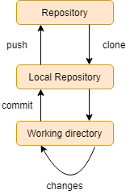
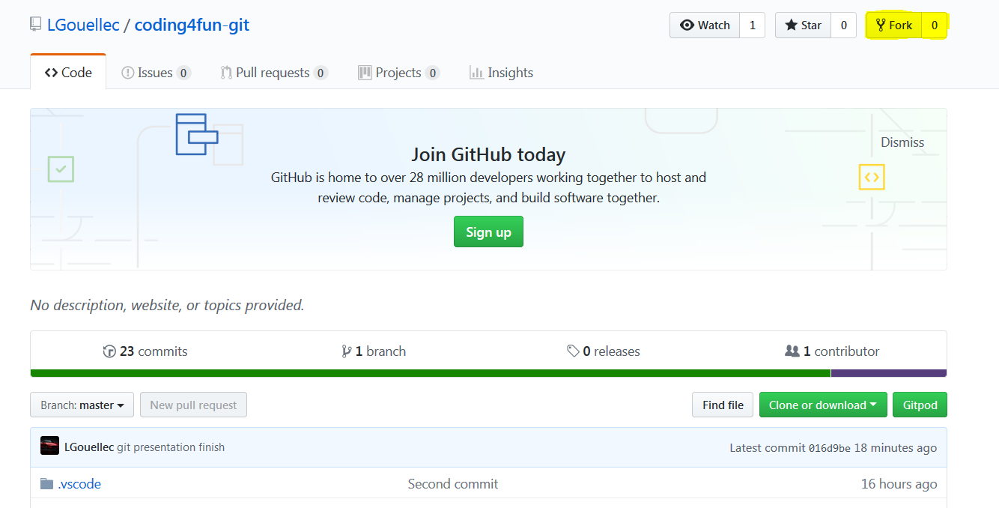
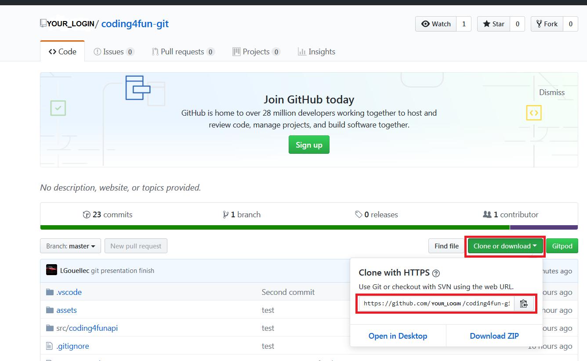
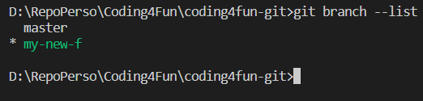
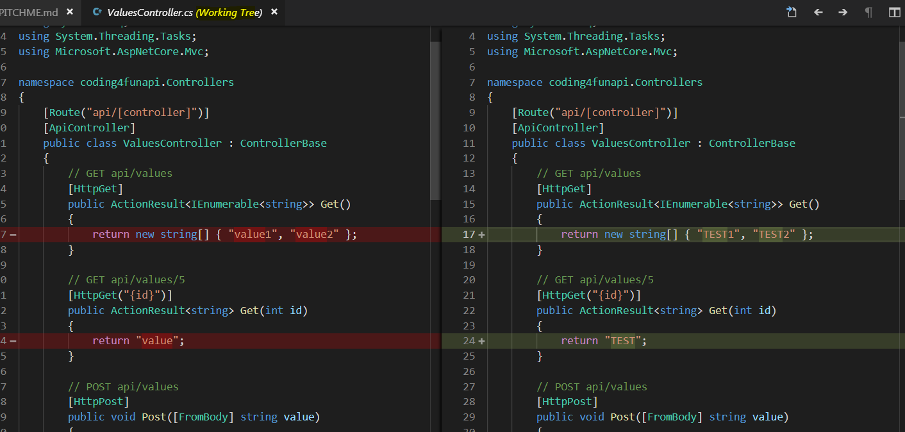
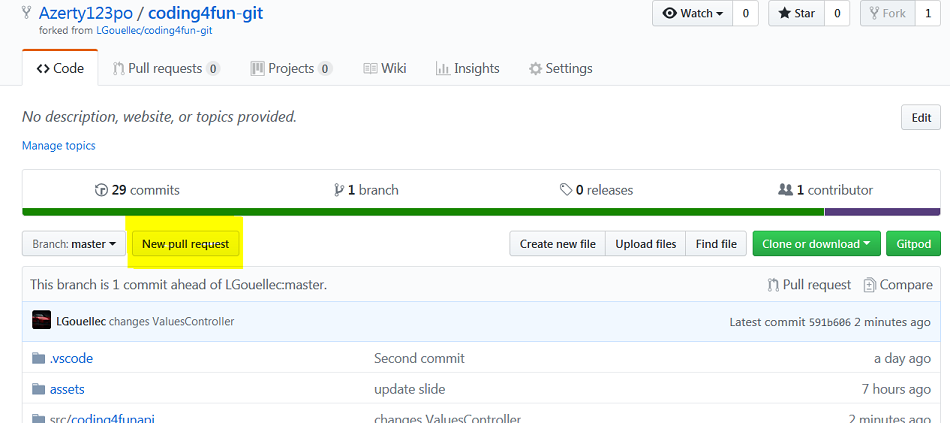
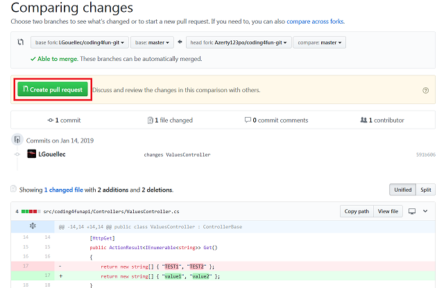
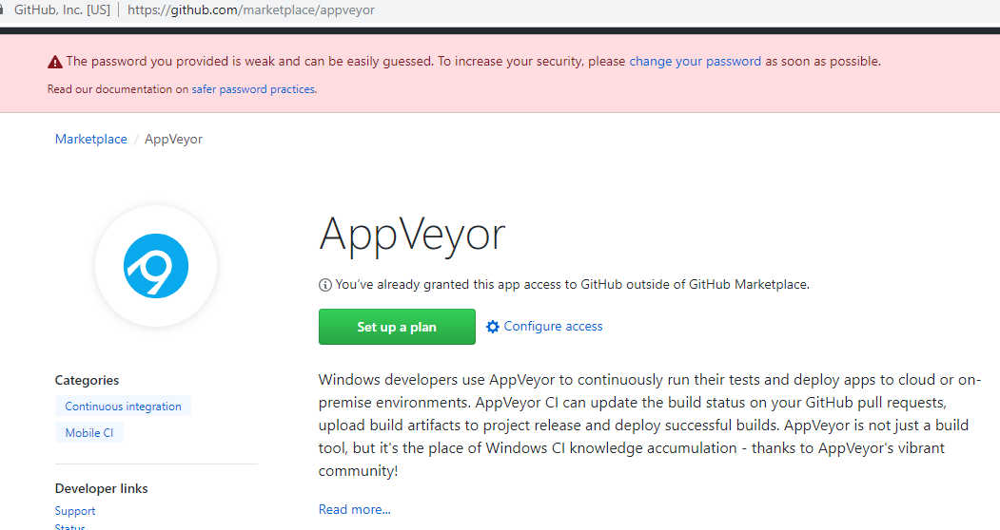
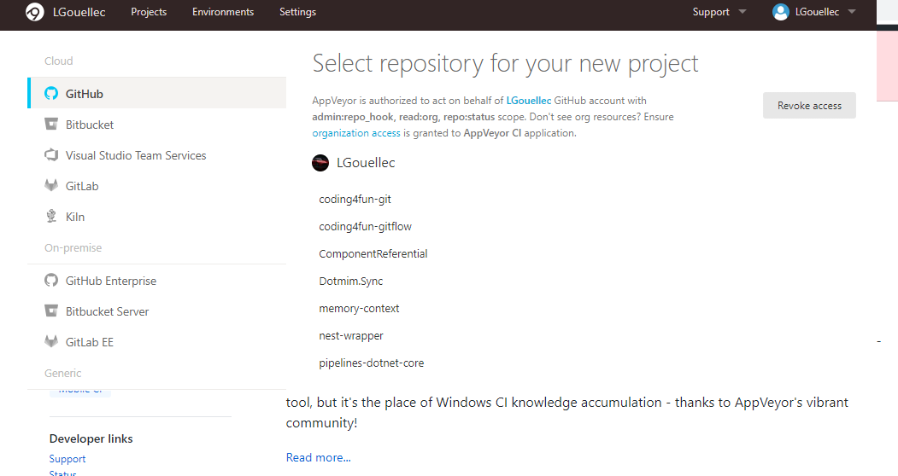

# Let's Get Started

---
@title[Git architecture]

@snap[west span-50]
@ul[spaced text-white]
- Git is a distributed version control system (vs SVN which is centralized)
- Most used => Github, GitLab, Local Git, Bitbucket
@ulend
@snapend

@snap[east span-50]

@snapend

---
@title[Git : CLONE]
### @css[headline](Clone repository)

---
@title[Git : CLONE]
@snap[west span-50]
### Clone : Get copy about remote repository
@snapend

@snap[east span-50]

@snapend

---
@title[Trees]
### @css[headline](Local Trees)

---
@title[Trees]
@snap[west span-50]
@ul[spaced text-white]
- Local repository contains 3 trees
- Working home : Contains source files
- Index : Tempory space
- HEAD : Last validation
@ulend
@snapend

@snap[east span-50]

@snapend

---
@title[Add and Commit]
### @css[headline](Add and Commit)

---
@title[Add and Commit]
@ul[spaced text-white]
- Propose a change (add changeset in Index) : git add FILENAME
- Valid changes (file added in HEAD): git commit -m 'Validation message'
@ulend

---
@title[Send changes]
### @css[headline](Send changes)

---
@title[Send changes]
@ul[spaced text-white]
- Send changes from HEAD to remote repository : git push origin master (git push REMOTE BRANCH)
- You can add new remote : git remote add REMOTE_NAME SERVER
@ulend

---
@title[Branch]
### @css[headline](Branch)

---
@title[Branch]
@ul[spaced text-white]
- Create new branch : git checkout -b feature_x
- Change branch : git checkout master
- Remove branch : git branch -d feature_x
- Push branch to remote : git push origin feature_x
@ulend

---
@title[Update & Merge]
### @css[headline](Update & Merge)

---
@title[Update & Merge]
@ul[spaced text-white]
- Update local repository : git pull
- Merge branch : git merge BRANCH
- git diff SOURCE_BRANCH TARGET_BRANCH
@ulend

---
@title[Others commands]
### @css[headline](Others commands)

---
@title[Others commands]
@ul[spaced text-white]
- Create tag : git tag VERSION ID (get ID with git log) (ex : git tag 1.0.0 1b2e1d63ff)
- Cancel local changeset : git checkout -- FILENAME
- git diff SOURCE_BRANCH TARGET_BRANCH
- Remove all changes and local validation : git fetch origin & git reset --hard origin/master
@ulend

---?color=#F6D365
@title[Contrib in open source project]
@box[bg-orange text-white rounded demo-box-pad](Contrib in open source project)

---
@title[FORK]
@snap[north span-50]
### FORK my repository
@snapend

@snap[south span-50]
https://github.com/LGouellec/coding4fun-git

@snapend

---
@title[CLONE]
@snap[north span-50]
### CLONE your repository
@snapend

@snap[south span-50]

@snapend

---
@title[Branch]
@snap[north span-50]
### Create your branch
@snapend

@snap[south span-50]
git checkout -b YOUR_FEATURE_NAME

@snapend

---
@title[Make your changes]
@snap[west span-50]
@ul[spaced text-white]
- Make your changes
- Don't forget to add changed file to index : (git add filename)
- git commit -m 'Added feature'
- git push origin my-new-f
@ulend
@snapend

@snap[east span-50]

@snapend

---
@title[Pull request]
@snap[north span-30]
Pull Request
@snapend

@snap[south span-70]

@snapend

---
@title[Pull request]
@snap[north span-30]
Pull Request
@snapend

@snap[south span-70]

@snapend

---
@title[CI]
@ul[spaced text-white]
- https://github.com/marketplace/category/continuous-integration
- Find AppVeyor
@ulend

---
@title[CI]
@snap[north span-50]

@snapend

@snap[south span-50]

@snapend

---
@title[Bonus]
@ul[spaced text-white]
- https://github.com/marketplace/category/continuous-integration
- Find AppVeyor
@ulend
